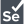

  

___

## :man_technologist: About Me :
### - I`m automation QA 🤖 
### - I love new knowledge 📖
### - I love swimming 🏊‍♂️
  
___

### :hammer_and_wrench: Languages and Tools :
&nbsp;&nbsp;
&nbsp;&nbsp;
&nbsp;&nbsp;
&nbsp;&nbsp;

### Connect with me:
___

&nbsp;&nbsp;

  
___

<!--
**ZhuraTown/ZhuraTown** is a ✨ _special_ ✨ repository because its `README.md` (this file) appears on your GitHub profile.

Here are some ideas to get you started:

- 🔭 I’m currently working on ...
- 🌱 I’m currently learning ...
- 👯 I’m looking to collaborate on ...
- 🤔 I’m looking for help with ...
- 💬 Ask me about ...
- 📫 How to reach me: ...
- 😄 Pronouns: ...
- ⚡ Fun fact: ...
-->
